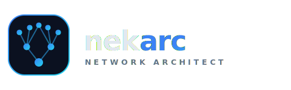

<div align="center">
  

  <p><strong>Design a complete enterprise LAN from a plain description of a building.</strong></p>

  <p>
    
    
    
    
    
    
  </p>
</div>

---

## What it is

**nekarc** (Network Architect) turns a simple building description — floors → rooms → device counts —
into a full network design: a topology diagram, a bill of materials, an IP plan, a VLAN scheme, and a
downloadable PDF report.

The whole product is one pure transformation:

```
building description  →  calcNetwork()  →  network design
(floors / rooms / devices)                 (switches · APs · IPs · VLANs · BOM)
```

It codifies a network engineer's sizing heuristics — count devices by role, then apply fixed capacity
ratios (20 clients per Wi-Fi 6 AP, +20% switch-port headroom, role-based VLANs, a `/24` per segment) — so
a non-expert gets a credible, standards-backed design (IEEE 802.11ax · TIA-568-D · RFC 1918).

## Features

- 🔐 **Accounts** — register, login, JWT auth, forgot/reset password
- 🏢 **Building editor** — floors, rooms, and five device roles (workstations, WiFi, printers, cameras, servers)
- ⚡ **Instant design** — diagram, equipment list, IP plan, VLAN plan, per-floor summary
- 📐 **Building plans** — upload a **DXF** (auto-read rooms) or a **PNG/JPG** (trace rooms) — *in progress*
- 📄 **PDF export** — a shareable network-design report, rendered server-side

## Tech stack

| Layer | Stack |
|-------|-------|
| **Frontend** | React 18 · TypeScript · Vite · React Router |
| **Backend** | FastAPI · SQLAlchemy 2 · Pydantic v2 |
| **Database** | SQLite (relational) |
| **Auth** | JWT (access + refresh) · bcrypt |
| **CAD / geometry** | ezdxf · shapely |
| **PDF** | reportlab |

## Quick start

```bash
./start.sh     # sets up venv + npm, starts both servers
./stop.sh      # stops them
```

- Frontend → http://localhost:5173
- API docs → http://localhost:8000/docs

Then register an account and create your first building.

## Project structure

```
nekarc/
├── nekarc-backend-api/      FastAPI + SQLite
│   ├── app/
│   │   ├── models/          SQLAlchemy tables (user, project, floor, room, asset, …)
│   │   ├── schemas/         Pydantic request/response
│   │   ├── api/routes/      auth · users · projects · uploads · cad · export
│   │   ├── core/            security (JWT, bcrypt) · email
│   │   └── services/        cad_parser · geometry · pdf_report
│   └── data/                app.db + uploads/ (git-ignored)
├── nekarc-frontend/         React + Vite + TS
│   └── src/
│       ├── engine/          calcNetwork — the core sizing logic (runs client-side)
│       ├── pages/           auth · Dashboard · ProjectEditor · results/
│       ├── auth/            AuthContext · ProtectedRoute
│       └── api/             typed fetch client
├── start.sh · stop.sh · push-to-github.sh
└── handoff.md               continue work in a fresh session
```

## Deploy / push

```bash
./push-to-github.sh    # prompts for a commit message, pushes to GitHub
```

## License

Private project — all rights reserved.
